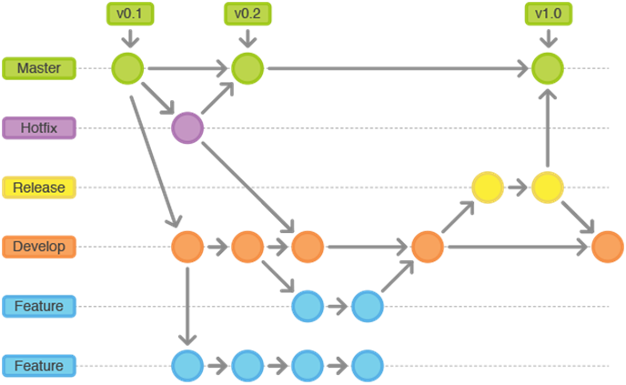

# Metodologia

A metodologia consiste na definição das ferramentas utilizadas pela equipe tanto para a manutenção dos códigos e demais artefatos quanto para a organização do time na execução das tarefas do projeto.

## Controle de Versão

O código fonte da solução a ser desenvolvida pela equipe será gerido através de repositório específico na plataforma GitHub. O processo de versionamento será feito de acordo com a padronização da própria plataforma, que possibilita a visualização descomplicada da colaboração de cada componente da equipe, bem como a rápida detecção de alterações e incrementos no código.
Neste sentido, as atividades de cooperação da equipe serão feitas através de comandos de “new branch, commit, pull request”, entre outros, o que possibilitará a anuência prévia dos demais integrantes da equipe, tendendo a tornar harmoniosa a interação.

## Gerenciamento de Projeto

### Divisão de Papéis

A organização da equipe se dará da seguinte forma:

- Scrum Master: Júlio;
- Product Owner: Professor Carlos Pietrobon;
- Equipe de Desenvolvimento: Flávia, Paulo, Raphael;
- Design: Isabela.

Apresente a divisão de papéis entre os membros do grupo.

### Processo

No processo de implementação do Scrum o grupo irá fazer uso de ferramentas on-line para acompanhar o andamento do projeto, a execução das tarefas e o status de desenvolvimento da solução, sendo essencialmente as ferramentas Trello e Google Drive.

### Ferramentas

Também serão empregadas as seguintes ferramentas:

- Ferramentas de comunicação: Teams, Whatsapp, Discord;
- Ferramentas de desenho de tela (wireframing): Figma;
- Editor de código fonte (multiplataforma): Microsoft Visual Studio Code;
- Armazenamento em nuvem: Microsoft Windows Azure.

O uso eventual de outras ferramentas poderá ser incorporado à descrição do projeto no decorrer de sua execução.

## Relação de ambientes de trabalho utilizados:

Para a construção e desenvolvimento do projeto, o ambiente de trabalho a ser utilizado pela equipe responsável será implementado, organizado e gerido em concordância com a metodologia que proporcione o melhor uso das ferramentas disponíveis para realização de reuniões, organização dos dados, inclusão ou alteração de informações no código, entre outras definições que competirá à equipe.
Partindo da necessidade de organizar o fluxo e as demandas de trabalho, a equipe fará uso da ferramenta de gestão de projetos Trello para alinhamento das tarefas e demais particularidades inerentes às incumbências de cada membro da equipe.
Já o versionamento e gerenciamento do projeto será feito através de repositório armazenado na plataforma GitHub, onde todos os integrantes da equipe terão pleno acesso para inclusão ou alteração de informações no código principal.
A incorporação de outros elementos para execução de tarefas e desenvolvimento da solução, tais como, editor de código, ferramentas de comunicação, edição gráfica e prototipagem de projetos, implementação de banco de dados, hospedagem, entre outros, será feita sempre de forma simétrica com os demais métodos acordados.

| Ambiente                           | Plataforma            | Link de Acesso                                                                                                  |
| ---------------------------------- | --------------------- | --------------------------------------------------------------------------------------------------------------- |
| Repositório do código fonte        | GitHub                | [Git Hub](https://github.com/ICEI-PUC-Minas-PMV-ADS/pmv-ads-2022-1-e2-proj-int-t3-estacionamento.git)           |
| Documentos do projeto              | Google Drive e Trello | [Google Docs](https://docs.google.com/document/d/11JWdINM7DoQ2F-cFjEfDqb2kMQOEp7MjONuuooynZIg/edit?usp=sharing) |
| Projeto de interfaces e wireframes | Figma                 | [Figma](https://www.figma.com/files/team/1093312477471165818/Why-Park?fuid=1021894970703148295)                 |
| Gerenciamento do projeto           | Trello                | [Trello](https://trello.com/b/sGbNm2GI/estacionamento)                                                          |

## Gestão de código fonte

Para gestão do código fonte do software desenvolvido pela equipe será utilizado o processo baseado no Git Flow, conforme descrito na figura a seguir. Deste modo, as manutenções do código serão realizadas de forma separada, sempre identificadas, possibilitando o monitoramento das atualizações e consequentemente otimizando a gestão do projeto como um todo.  

