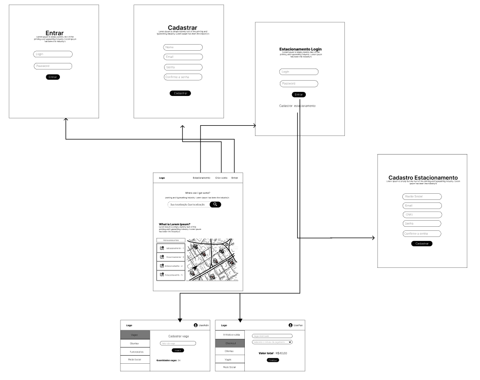

# Projeto de Interface

Pré-requisitos: <a href="2-Especificação do Projeto.md"> Documentação de Especificação</a>

Visão geral da interação do usuário pelas telas do sistema e protótipo interativo das telas com as funcionalidades que fazem parte do sistema (wireframes).

 Apresente as principais interfaces da plataforma. Discuta como ela foi elaborada de forma a atender os requisitos funcionais, não funcionais e histórias de usuário abordados nas <a href="2-Especificação do Projeto.md"> Documentação de Especificação</a>.

## Diagrama de Fluxo

O diagrama apresenta o estudo do fluxo de interação do usuário com o sistema interativo e  muitas vezes sem a necessidade do desenho do design das telas da interface. Isso permite que o design das interações seja bem planejado e gere impacto na qualidade no design do wireframe interativo que será desenvolvido logo em seguida.

O diagrama de fluxo pode ser desenvolvido com “boxes” que possuem internamente a indicação dos principais elementos de interface - tais como menus e acessos - e funcionalidades, tais como editar, pesquisar, filtrar, configurar - e a conexão entre esses boxes a partir do processo de interação. Você pode ver mais explicações e exemplos https://www.lucidchart.com/blog/how-to-make-a-user-flow-diagram.

As referências abaixo irão auxiliá-lo na geração do artefato “Diagramas de Fluxo”.

> **Links Úteis**:
> - [Fluxograma online: seis sites para fazer gráfico sem instalar nada | Produtividade | TechTudo](https://www.techtudo.com.br/listas/2019/03/fluxograma-online-seis-sites-para-fazer-grafico-sem-instalar-nada.ghtml)

## Wireframes

São protótipos usados em design de interface para sugerir a estrutura de um site web e seu relacionamentos entre suas páginas. Um wireframe web é uma ilustração semelhante do layout de elementos fundamentais na interface.
 
<<<<<<< HEAD
=======
> **Links Úteis**:
> - [Protótipos vs Wireframes](https://www.nngroup.com/videos/prototypes-vs-wireframes-ux-projects/)
> - [Ferramentas de Wireframes](https://rockcontent.com/blog/wireframes/)
> - [MarvelApp](https://marvelapp.com/developers/documentation/tutorials/)
> - [Figma](https://www.figma.com/)
> - [Adobe XD](https://www.adobe.com/br/products/xd.html#scroll)
> - [Axure](https://www.axure.com/edu) (Licença Educacional)
> - [InvisionApp](https://www.invisionapp.com/) (Licença Educacional)

## Plano de Testes de Software

A seguir serão apresentados os dados colhidos durante a execução do plano de testes de software conforme os cenários que se apresentarem no decorrer do desenvolvimento da aplicação.
Para tal, serão exigidos requisitos indispensáveis à execução, sendo estes:
1. Dispositivo conectado à internet;
2. Navegador da internet;
3. Site hospedado.

Para a realização dos testes, será utilizado o **Teste Funcional ou Teste da Caixa Preta**, em que serão verificados os aspectos externos do sistema. Serão testados os requisitos funcionais, as funções e os casos de uso. Será avaliado se um grupo de entrada de dados resultou nas saídas pretendidas.
Eventualmente, poderão ser aplicados os seguintes testes:
* Teste de Unitário ou Teste de Unidade: serão avaliados isoladamente o banco de dados, a interface gráfica e todos os outros componentes do projeto.  Objetivo da técnica: encontrar falhas de funcionamento dentro de uma pequena parte do sistema funcionando independentemente do todo;
* Teste de Segurança: será avaliado se o sistema e os dados são acessados de maneira segura e apenas pelo autor das ações. Objetivo: evitar fraudes, interceptação de informação que está sendo trafegada, coleta de dados sensíveis.

Os testes funcionais a serem realizados no aplicativo estão descritos a seguir:

| Caso de Teste | **CT-01** Cadastrar Cliente do Estacionamento |
|:-----------------------:|-----------------------------------|
|Requisitos Associados|RF-02|
|Objetivo do Teste| Verificar se o cliente consegue efetuar o seu próprio cadastro a partir das informações exigidas para tanto pelo sistema|
|Passos| 1. O usuário deve acessar o site através do navegador;  2. O usuário deve escolher a opção cadastrar usuário;  3. O usuário deve inserir nome e email;  4. O usuário deve clicar em cadastrar cliente;  5. A tela deve retornar ao cliente mensagem de confirmação de cadastro realizado com sucesso.|
|Critérios de Êxito| O resultado será considerado satisfatório quando: * O sistema reportar mensagem de confirmação de realização do cadastro; * O sistema direcionar automaticamente o usuário para tela de login.|

 

| Caso de Teste | **CT-02** Cadastrar Estacionamento |
|:-----------------------:|-----------------------------------|
|Requisitos Associados|RF-06|
|Objetivo do Teste| Verificar se é possível realizar o cadastro de uma empresa de estacionamento a partir das informações exigidas para tanto pelo sistema. |
|Passos| 1. O usuário deve acessar o site através do navegador;  2. O usuário deve escolher a opção cadastrar estabelecimento;  3. O usuário deve inserir razão social, CNPJ, endereço, telefone e email;  4. O usuário deve clicar em cadastrar estabelecimento;  5. A tela deve retornar ao cliente mensagem de confirmação de cadastro realizado com sucesso.|
|Critérios de Êxito| O resultado será considerado satisfatório quando: * O sistema direcionar automaticamente o usuário para tela de gestão do estabelecimento; * O sistema reportar mensagem de confirmação de realização do cadastro.|

 

| Caso de Teste | **CT-03** Cadastrar Gestor do Estacionamento |
|:-----------------------:|-----------------------------------|
|Requisitos Associados|RF-06, RF-07|
|Objetivo do Teste| Verificar se é possível o gestor do estacionamento realizar o seu cadastro após o cadastro do estacionamento, a partir das informações exigidas para tanto pelo sistema. |
|Passos| 1. O usuário deve acessar o site através do navegador;  2. O usuário deve efetuar login;  3. O usuário deverá acessar a tela de gestão do estabelecimento;  4. O usuário deve escolher a opção cadastrar gestor;  5. O usuário deve criar ID e senha para o gestor;  6.O usuário deve clicar em cadastrar gestor;  7. A tela deve retornar ao usuário mensagem de confirmação de cadastro realizado com sucesso.|
|Critérios de Êxito| O resultado será considerado satisfatório quando: * O sistema direcionar automaticamente o usuário, após a realização do login, para tela de gestão do estabelecimento; * O sistema permitir a inserção dos dados de cadastro do gestor;  * Permitir a criação de ID e senha para o gestor cadastrado.|

 

| Caso de Teste | **CT-04** Cadastrar o Manobrista do Estacionamento |
|:-----------------------:|-----------------------------------|
|Requisitos Associados|RF-10|
|Objetivo do Teste| Verificar se é possível o gestor efetuar o cadastro de um funcionário denominado “manobrista” no sistema Why Park. |
|Passos| 1. O gestor deve acessar o site através do navegador;  2. O gestor deve escolher a opção cadastrar manobrista;  3. O gestor deve criar ID e senha para o manobrista;  4. O gestor deve clicar em cadastrar manobrista;  5. A tela deve retornar ao cliente mensagem de confirmação de cadastro realizado com sucesso.|
|Critérios de Êxito| O resultado será considerado satisfatório quando: * O sistema direcionar automaticamente o gestor, após a realização do login, para tela de gestão do estabelecimento; * O sistema permitir a inserção dos dados de cadastro do manobrista;  * O sistema permitir a criação de ID e senha para o manobrista cadastrado;  * O sistema reportar mensagem de confirmação de realização do cadastro.|

 

| Caso de Teste | **CT-05** Visualizar de vagas do estacionamento (Gestor e Manobrista) |
|:-----------------------:|-----------------------------------|
|Requisitos Associados|RF-08, RF-09, RF-10|
|Objetivo do Teste| Verificar se o gestor e o manobrista podem visualizar pelo sistema do Why Park:  * Quantidade de vagas disponíveis;  * Quantidade de vagas ocupadas;  * Quantidade de vagas reservadas;  * Quantidade de horas contratadas por cada veículo estacionado.|
|Passos| 1. O usuário deve acessar o site através do navegador;  2. O usuário deve informar ID e senha para acessar a tela de gestão do estacionamento;  3. O usuário deve acessar a tela contendo a informação sobre o número de vagas disponíveis ;  4. O usuário deve acessar a tela contendo a informação sobre o número de vagas ocupadas;  5. O usuário deve acessar a tela contendo a informação sobre o número de vagas reservadas;  6. O usuário deve acessar a tela contendo a informação com o número de horas contratadas por cada veículo estacionado.|
|Critérios de Êxito| O resultado será considerado satisfatório quando: * O usuário visualizar a quantidade de vagas disponíveis; * O usuário visualizar a quantidade de vagas ocupadas;  * O usuário visualizar a quantidade de vagas reservadas;  * O usuário visualizar a quantidade de horas contratadas por cada veículo.|

 

| Caso de Teste | **CT-6** Buscar um estacionamento |
|:-----------------------:|-----------------------------------|
|Requisitos Associados|RF-01, RF-03|
|Objetivo do Teste| Verificar se a busca de estacionamentos a ser realizada pelo cliente ocorre de forma correta, a partir das informações de endereço informadas em um campo de busca.|
|Passos| 1. O usuário deve acessar o site através do navegador;  2. O usuário deve habilitar a ferramenta de geolocalização do dispositivo;  3. O usuário deve visualizar os estabelecimentos localizados na região, conforme a localização do dispositivo.|
|Critérios de Êxito| A página deve apresentar os estacionamentos mais próximos do endereço informado, que tenham vagas disponíveis.|

 

| Caso de Teste | **CT-07** Realização de reserva de vaga pelo cliente em um estacionamento selecionado por ele |
|:-----------------------:|-----------------------------------|
|Requisitos Associados|RF-04|
|Objetivo do Teste| Verificar se é possível o cliente selecionar um dos estacionamentos apresentados para ele como resultado de sua busca, e, efetuar a sua reserva de vaga.|
|Passos| 1. O usuário deve escolher o estabelecimento de sua preferência;  2. O usuário deve escolher a opção realizar reserva;  3. O usuário deve inserir nome e email para efetuar login;  4. O usuário deve selecionar a quantidade de horas a serem reservadas;  5. O usuário deve informar a data para a reserva;  6. O usuário deve informar o horário previsto para entrada no estabelecimento;  7. O usuário deve informar o horário previsto para saída do estabelecimento;   8. O sistema deve direcionar o cliente para a tela de pagamento.|
|Critérios de Êxito| O resultado será considerado satisfatório quando: * O usuário conseguir visualizar os estabelecimentos disponíveis; * O usuário conseguir efetuar login;  * O usuário conseguir informar a data para a reserva;  * O usuário conseguir informar a quantidade de horas reservada;  * O usuário conseguir informar horário previsto para entrada e saída ao estabelecimento;  * O sistema direcionar o cliente para a tela de pagamento.|

 

| Caso de Teste | **CT-08** Realização de pagamento do usuário por meio do sistema Why Park |
|:-----------------------:|-----------------------------------|
|Requisitos Associados|RF-07, RF-14|
|Objetivo do Teste| Verificar se é possível o cliente efetuar o pagamento da reserva através das opções ofertadas pelo estabelecimento.|
|Passos| 1. O usuário deve, após informar data para reserva, quantidade de horas contratadas, horário previsto para entrada e saída do estabelecimento, ser direcionado para a tela de pagamento;  2. O usuário deve selecionar a forma de pagamento;  3. O usuário deve efetuar o pagamento;  4. A tela deve retornar ao usuário mensagem de confirmação ou negativa do pagamento;  5. A tela deve retornar ao cliente mensagem de confirmação de reserva efetuada com sucesso.|
|Critérios de Êxito| O resultado será considerado satisfatório quando: * O usuário efetuar o pagamento de acordo com a opção selecionada; * O sistema reportar mensagem de confirmação de realização da reserva;  * Quando a reserva não for concluída em razão da falta de pagamento por parte do usuário.|

 

| Caso de Teste | **CT-09** Possibilidade de o cliente salvar estacionamento como favorito |
|:-----------------------:|-----------------------------------|
|Requisitos Associados|RF-05|
|Objetivo do Teste| Verificar se é possível o cliente indicar como favorito determinado estabelecimento após o fim de sua estadia.|
|Passos| 1. O usuário deve, ao finalizar a utilização da vaga contratada, visualizar as informações do estabelecimento utilizado;  2. O usuário deve clicar na opção adicionar estabelecimento como favorito;  3. A tela deve retornar ao usuário mensagem de confirmação de sua escolha pela preferência do estabelecimento.|
|Critérios de Êxito| O resultado será considerado satisfatório quando: * As informações do estabelecimento forem apresentadas de forma suscinta ao usuário ao final da utilização dos serviços; * O usuário realizar com sucesso a adição do estabelecimento ao nível de favorito.|

 

| Caso de Teste | **CT-10** Possibilidade de o cliente avaliar o estacionamento |
|:-----------------------:|-----------------------------------|
|Requisitos Associados|RF-12|
|Objetivo do Teste| Verificar se é possível o cliente proceder com a avaliação de determinado estabelecimento após o fim de sua estadia. 
|Passos| 1. O usuário deve, ao finalizar a utilização da vaga contratada, ter a possibilidade de avaliar o estabelecimento utilizado;  2. O usuário deve clicar na opção avaliar estabelecimento;  3. O sistema deve permitir que o usuário visualize os critérios a serem avaliados;  4. O usuário deve selecionar as opções conforme sua preferência;  5. A tela deve retornar ao usuário mensagem de confirmação do registro de sua avaliação.|
|Critérios de Êxito| O resultado será considerado satisfatório quando: * O usuário conseguir acessar o ambiente de avaliação do estabelecimento; * O sistema ofertar ao usuário um rol de critérios a serem avaliados;  * O sistema registrar com sucesso a avaliação realizada do usuário.|

 

| Caso de Teste | **CT-11** Possibilidade de o gestor impulsionar o seu estacionamento nas redes sociais por meio do Sistema Why Park |
|:-----------------------:|-----------------------------------|
|Requisitos Associados|RF-13|
|Objetivo do Teste| Verificar se é possível que o gestor do estabelecimento conecte o sistema Why Park às redes sociais do estacionamento.| 
|Passos| 1. O gestor deve realizar login através de ID e senha;  2. O gestor deve acessar a tela de gestão do estabelecimento;  3. O gestor deve inserir o link do perfil da rede social escolhida no campo “impulsionar rede social”;  4. O gestor deve clicar em confirmar;  5. A tela deve retornar ao gestor a mensagem de confirmação da associação à rede social com o sistema Why Park.|
|Critérios de Êxito| O resultado será considerado satisfatório quando: * O gestor efetuar login no sistema; * O gestor acessar a tela de gestão do estabelecimento;  * O gestor inserir com sucesso o link da rede social escolhida;  * O gestor visualizar a mensagem de confirmação da conexão com a rede social.|

 

| Caso de Teste | **CT-12** Comunicação entre o estacionamento e o cliente por meio do Sistema Why Park |
|:-----------------------:|-----------------------------------|
|Requisitos Associados|RF-11|
|Objetivo do Teste| Verificar se o sistema possibilita o estabelecimento comunicação entre o estabelecimento e o cliente.| 
|Passos| 1. O sistema deve apresentar ao cliente logado, atalho para chat que viabilize a comunicação direta com o estabelecimento escolhido para reserva;  2. O sistema deve apresentar ao estabelecimento a possibilidade de comunicação via chat com o cliente logado. |
|Critérios de Êxito| O resultado será considerado satisfatório quando: * O cliente conseguir se comunicar com o estabelecimento após login no sistema; * O estabelecimento conseguir se comunicar com o cliente logado.|

## Plano de Testes de Usabilidade

O teste do usuário (ou teste de usabilidade) consiste em uma verificação da interface de uma plataforma digital, considerando a interação com o usuário.
O objetivo do teste é observar as principais dificuldades no uso do sistema para assim ser possível realizar melhorias e, por consequência, proporcionar uma melhor experiência ao usuário. 
Para realização deste teste, serão utilizados Testes Remotos Não Moderados de Usabilidade como método, feitos de forma online. Os participantes dos testes efetuarão os estudos diretamente em seus próprios dispositivos, como tablets, smartphones e notebooks.
Como diretriz principal do teste, serão observadas as dez heurísticas de Nielsen, quais sejam: 

- Visibilidade do status do sistema;
- Correspondência entre o sistema e o mundo real;
- Liberdade e controle do usuário;
- Consistência e padrões;
- Prevenção de erros;
- Reconhecer ao invés de lembrar;
- Flexibilidade e Eficiência;
- Estética e Design minimalista;
- Auxiliar usuários a reconhecer, diagnosticar e recuperar erros;
- Ajuda e Documentação.

Serão mensurados durante o teste:

- Qualidade da navegação;
- Eficiência do processo de busca por estacionamento;
- Eficiência do processo de reserva do estacionamento;
- Eficiência do processo de cadastro do estacionamento;
-Eficiência do processo de interação com o sistema pelo gestor do - estacionamento;
- Satisfação dos usuários ao realizar tais processos.
 
>>>>>>> 71eb4cd2a921a1096863efd03143878033e9b09d
