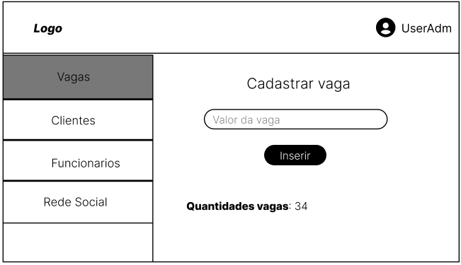

# Projeto de Interface

Pré-requisitos: [Documento de Contexto](01-Documenta%C3%A7%C3%A3o%20de%20Contexto.md)

Visão geral da interação do usuário pelas telas do sistema e protótipo interativo das telas com as funcionalidades que fazem parte do sistema (wireframes).

Apresente as principais interfaces da plataforma. Discuta como ela foi elaborada de forma a atender os requisitos funcionais, não funcionais e histórias de usuário abordados no [Documento de Contexto](01-Documenta%C3%A7%C3%A3o%20de%20Contexto.md).

## Diagrama de Fluxo

O processo interativo entre usuário e sistema se dará da seguinte forma:

## Wireframes Interativos

A elaboração da interface do sistema prioriza a simplicidade e é focado em agilidade e usabilidade. Assim, as telas são projetadas para funcionamento em desktops e dispositivos móveis.
As telas do sistema possuem uma estrutura padronizada, constituída de três grandes blocos, quais sejam:

1. Cabeçalho: local em que estão dispostos os elementos fixos da identidade (logomarca do site e links para o sistema interno do estacionamento, cadastro do cliente e login do cliente);
2. Conteúdo: local onde são apresentados campo de busca pelo endereço, mapa do local, estabelecimentos disponíveis, login e cadastro do cliente e do estacionamento;
3. Barra lateral: local onde fica barra de navegação para o cliente e para estacionamento.

O wireframe abaixo ilustra como será o layout dos elementos fundamentais na interface:

 
 

 
 

 
 

- Tela Home-Page 
  A tela de home-page apresenta no cabeçalho o nome do site com a logomarca no canto superior esquerdo e, a direita, os links para o sistema interno do estacionamento, cadastro do cliente e login do cliente.
  Em destaque, no centro da tela, há um campo de busca para que o cliente do estacionamento possa informar o seu endereço/localização e poder efetuar a busca pelos estacionamentos cadastrados mais próximos, que contenham vagas disponíveis.
  Abaixo, haverá um mapa que mostrará a localização de cada estacionamento disponível e uma barra lateral com as informações de cada um deles, como nome, endereço, telefone e redes sociais.

 

- Tela Login do Cliente 
  A tela de login é para que o cliente do estacionamento seja autorizado a utilizar a aplicação e assim fazer sua reserva no estacionamento. Será exibida no bloco de conteúdo, ao pressionar o “entrar”, localizado no canto superior direito do cabeçalho. Nesta tela, o usuário deverá inserir o nome e a senha registrados por ele no site, e clicar no botão de "entrar".

 

- Tela Cadastro do Cliente 
  A tela de cadastro será acessada ao pressionar “criar conta”, localizado no canto superior direito do cabeçalho. Também será exibida no bloco de conteúdo, e apresenta campos para o usuário preencher com nome completo, e-mail, senha e confirmação de senha. Ao preencher basta pressionar o botão “Cadastrar” e o cadastro estará finalizado.

 

- Tela Login do Estacionamento 
  A tela de login do estacionamento permite que o gestor possa utilizar o sistema Why Park. Para isso, basta pressionar o “estacionamento”, localizado no canto superior direito do cabeçalho. Será exibido no bloco de conteúdo campos de login e senha que deverão ser preenchidos. Após, basta clicar em “entrar”. Nesta tela também haverá um link "Cadastrar estacionamento" que levará o usuário para a tela "Cadastro de estacionamento", caso não tenha se registrado ainda.

 

- Tela Cadastro do Estacionamento 
  Nesta tela serão apresentados campos de preenchimento obrigatório: razão social, CNPJ, email, senha e confirmação de senha. Ao preencher basta pressionar o botão “Cadastrar” e o cadastro estará finalizado.

 

- Tela Navegação do Estacionamento 
  A tela de navegação do estacionamento será exibida após efetuação do login, Nesta tela, o gestor do estacionamento cadastrado poderá clicar na barra lateral para poder visualizar e cadastrar vagas, visualizar clientes e funcionários, cadastrar funcionários, visualizar as entradas e saídas dos clientes, além de poder impulsionar o seu estabelecimento nas redes sociais por meio da própria aplicação. Os conteúdos de cada uma destas opções serão exibidos no bloco de conteúdo.

 

A navegação entre as telas ocorrerá de acordo com o fluxograma abaixo:

