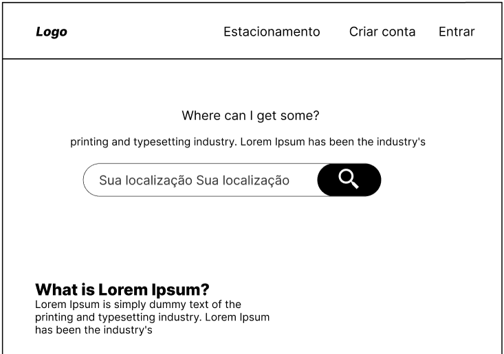

# Projeto de Interface

Pré-requisitos: <a href="2-Especificação do Projeto.md"> Documentação de Especificação</a>

Visão geral da interação do usuário pelas telas do sistema e protótipo interativo das telas com as funcionalidades que fazem parte do sistema (wireframes).

Apresente as principais interfaces da plataforma. Discuta como ela foi elaborada de forma a atender os requisitos funcionais, não funcionais e histórias de usuário abordados nas <a href="2-Especificação do Projeto.md"> Documentação de Especificação</a>.

## Diagrama de Fluxo

O diagrama apresenta o estudo do fluxo de interação do usuário com o sistema interativo e muitas vezes sem a necessidade do desenho do design das telas da interface. Isso permite que o design das interações seja bem planejado e gere impacto na qualidade no design do wireframe interativo que será desenvolvido logo em seguida.

O diagrama de fluxo pode ser desenvolvido com “boxes” que possuem internamente a indicação dos principais elementos de interface - tais como menus e acessos - e funcionalidades, tais como editar, pesquisar, filtrar, configurar - e a conexão entre esses boxes a partir do processo de interação. Você pode ver mais explicações e exemplos https://www.lucidchart.com/blog/how-to-make-a-user-flow-diagram.

As referências abaixo irão auxiliá-lo na geração do artefato “Diagramas de Fluxo”.

> **Links Úteis**:
>
> - [Fluxograma online: seis sites para fazer gráfico sem instalar nada | Produtividade | TechTudo](https://www.techtudo.com.br/listas/2019/03/fluxograma-online-seis-sites-para-fazer-grafico-sem-instalar-nada.ghtml)

## Wireframes Interativos

A elaboração da interface do sistema prioriza a simplicidade e é focado em agilidade e usabilidade. Assim, as telas são projetadas para funcionamento em desktops e dispositivos móveis.
As telas do sistema possuem uma estrutura padronizada, constituída de três grandes blocos, quais sejam:

1. Cabeçalho: local em que estão dispostos os elementos fixos da identidade (logomarca do site e links para o sistema interno do estacionamento, cadastro do cliente e login do cliente);
   
2. Conteúdo: local onde são apresentados campo de busca pelo endereço, mapa do local, estabelecimentos disponíveis, login e cadastro do cliente e do estacionamento;
   

3. Barra lateral: local onde fica barra de navegação para o cliente e para estacionamento.
   

   São protótipos usados em design de interface para sugerir a estrutura de um site web e seu relacionamentos entre suas páginas. Um wireframe web é uma ilustração semelhante do layout de elementos fundamentais na interface.

São protótipos usados em design de interface para sugerir a estrutura de um site web e seu relacionamentos entre suas páginas. Um wireframe web é uma ilustração semelhante do layout de elementos fundamentais na interface.

  <<<<<<< HEAD
   
  =======
   
  > > > > > > > 71eb4cd2a921a1096863efd03143878033e9b09d
  > > > > > > > 8b98676f73912e27842e0939f766dc174ce2c0d9
