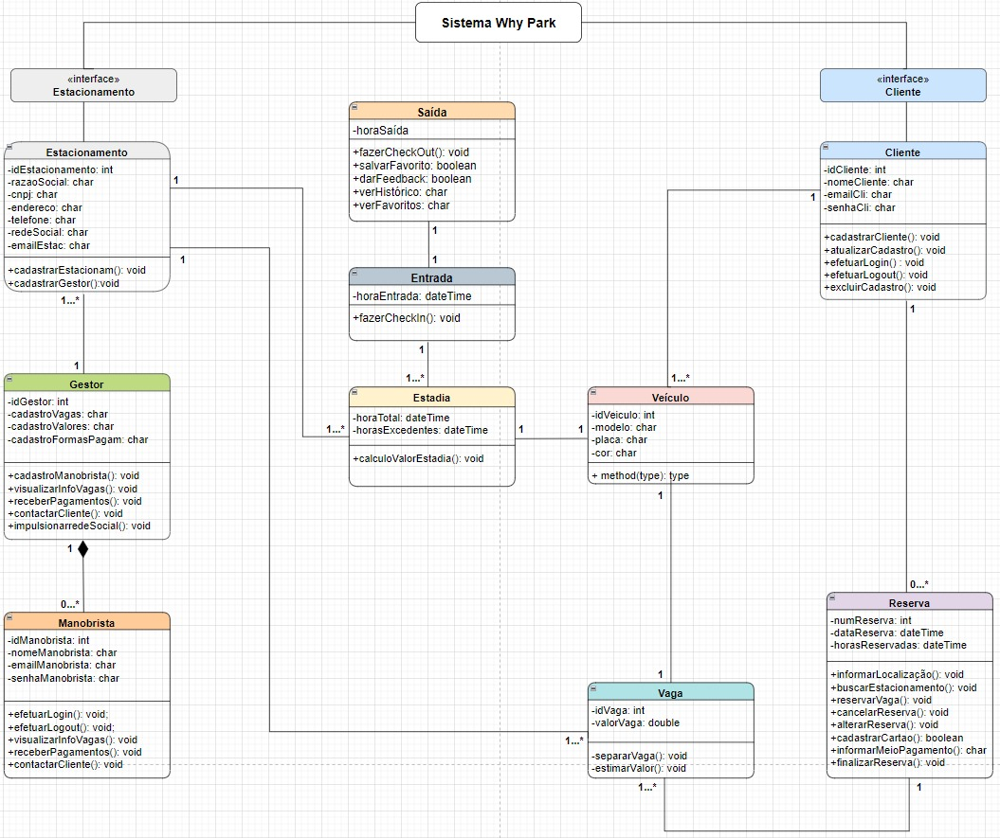

# Arquitetura da Solução

A arquitetura da solução é a descrição de como a solução será estruturada pela equipe. Contém os detalhes técnicos da aplicação e trata dos componentes que fazem parte da solução e do ambiente em que está ficará hospedada.

## Diagrama de Classes

A estrutura do software abaixo representada pelo diagrama de classes, ilustra de forma detalhada as interligações entre as classes que embasarão a materialização dos objetos do sistema.

## Modelo ER

O Modelo ER representa através de um diagrama como as entidades (coisas, objetos) se relacionam entre si na aplicação interativa.

## Esquema Relacional

O Esquema Relacional corresponde à representação dos dados em tabelas juntamente com as restrições de integridade e chave primária.
 
As referências abaixo irão auxiliá-lo na geração do artefato “Esquema Relacional”.

